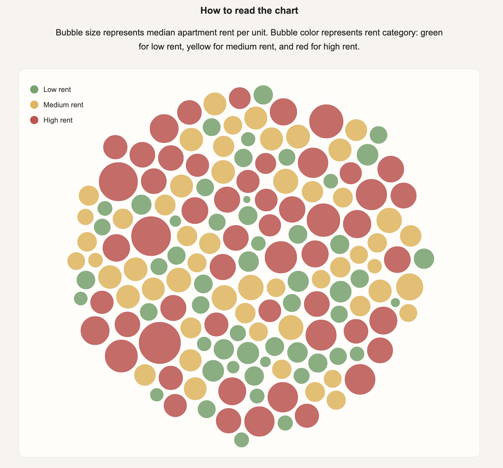

# Seattle's Housing Costs Are Unevenly Distributed

Author: Alejandra Chavarria

## Overview

This project explores apartment rent patterns across Seattle using a bubble chart created with D3.js. Each bubble represents a Seattle community reporting area. Bubble size corresponds to the median apartment rent per unit, while bubble color indicates whether the area falls into a low, medium, or high rent category.

The visualization is designed to communicate a public-facing narrative about housing affordability in Seattle. Larger red bubbles highlight areas with higher apartment rents, demonstrating that housing costs are not distributed evenly across the city. High-rent neighborhoods remain concentrated in several central Seattle communities, while lower-rent areas are distributed elsewhere throughout the city.

## Visualization

 

## Data Source

The data used in this visualization comes from the Seattle Open Data Portal's Apartment Market Rent Prices by Census Tract dataset. The original dataset was cleaned and filtered to include 2025 observations and the variables needed for this visualization.

## Design Choices

- Bubble Size: Represents median apartment rent per unit.
- Bubble Color: Represents rent category (Low, Medium, High).
- Force Simulation: Used to prevent bubble overlap and create a readable layout.
- Tooltip: Displays the community reporting area, median rent, and rent category when users hover over a bubble.
- Narrative Elements: A title, photo, explanatory text, and references were included to create a data journalism style presentation.

## Technologies Used

- HTML
- CSS
- JavaScript
- D3.js Version 7

## References

D3 Graph Gallery. "Basic Bubble Plot." Accessed June 5, 2026. https://d3-graph-gallery.com/graph/bubble_basic.html.

D3 Graph Gallery. "Bubble Chart with Colors." Accessed June 5, 2026. https://d3-graph-gallery.com/graph/bubble_color.html.

D3 Graph Gallery. "Bubble Chart with Tooltip." Accessed June 5, 2026. https://d3-graph-gallery.com/graph/bubble_tooltip.html.

D3.js. "Force Simulations." Accessed June 5, 2026. https://d3js.org/d3-force/simulation.

Seattle Open Data. "Apartment Market Rent Prices by Census Tract." Accessed June 5, 2026. https://data.seattle.gov/dataset/Apartment-Market-Rent-Prices-by-Census-Tract/h27p-5k3i/about_data.

Sebastian_127. "Seattle Skyline Space Needle." Pixabay. Accessed June 5, 2026. https://pixabay.com/photos/seattle-skyline-space-needle-4939579/.
